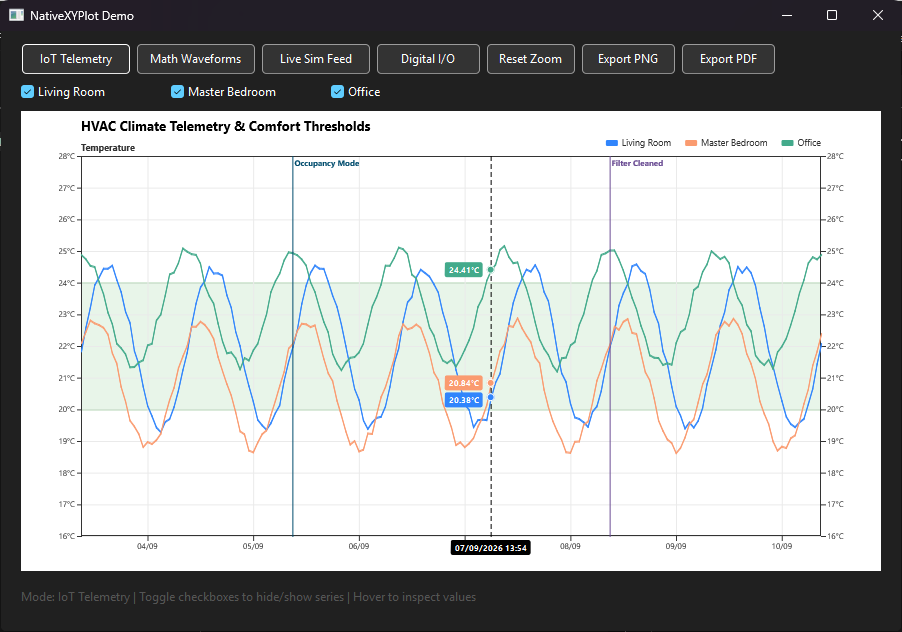

# NativeXYPlot for Xojo

Zero-dependency 2D plotting and time-series charting library in 100% native Xojo code.



---

## Features

- **Pure Native**: Desktop & Web compatible (`Graphics`, `Picture`).
- **Data Modes**: Time-Series (`DateTime`), Numeric Linear, Boolean / Digital Step-Lines, Discrete Y Labels.
- **Fast Interactive Tracking**: Decoupled static bitmap buffer + 60 FPS hover overlay (`DrawTrackingOverlay`).
- **Annotations**: Tolerance bands (`AddThreshold`), vertical markers (`AddMarker`), dual Y axes, customizable legends.

---

## Quickstart

```vb
// 1. Create and configure plot
Var plot As New NativeXYPlot(Canvas1.Width, Canvas1.Height)
plot.AddTitle("Telemetry Monitor")
plot.SetPlotArea(60, 45, Canvas1.Width - 120, Canvas1.Height - 80)
plot.SetXDateScale(dStart.SecondsFrom1970, dEnd.SecondsFrom1970)
plot.SetYLinearScale(15.0, 30.0, "°C")

// 2. Add data series & annotations
plot.AddThreshold(20.0, 24.0, &cE8F5E9, &c81C784)
plot.AddDateSeries(dateArray, tempArray, &c3185FC, "Sensor 1", 2)
plot.AddMarker(eventDate.SecondsFrom1970, "Alert", &cE63946)

// 3. Render
Canvas1.Backdrop = plot.MakeChartPicture()
```

---

## Interactive Hover Tracking (Canvas)

```vb
// Canvas.Opening / Update:
mBasePicture = mPlot.MakeChartPicture()
Canvas1.Refresh

// Canvas.MouseMove:
mMouseX = X
mMouseY = Y
Canvas1.Refresh

// Canvas.Paint:
Sub Paint(g As Graphics, areas() As Rect)
  If mBasePicture <> Nil Then g.DrawPicture(mBasePicture, 0, 0)
  If mPlot <> Nil And mMouseX >= 0 Then
    mPlot.DrawTrackingOverlay(g, mMouseX, mMouseY, True)
  End If
End Sub
```

---

## Documentation

See [docs/DOCUMENTATION.md](docs/DOCUMENTATION.md) for full API reference, properties, and usage recipes.

---

## Repository Structure

```
├── .gitattributes                # LF normalization
├── .gitignore                   # Build & debug artifact ignore rules
├── README.md                    # Overview & quickstart
├── docs/
│   ├── DOCUMENTATION.md         # Full API & architecture reference
│   └── Screenshot.png           # Showcase screenshot
├── src/
│   └── NativeXYPlot.xojo_code   # Core plot engine class
└── demo/
    ├── Sample.xojo_project      # Showcase desktop demo project
    └── ...
```

---

## License

MIT License.
