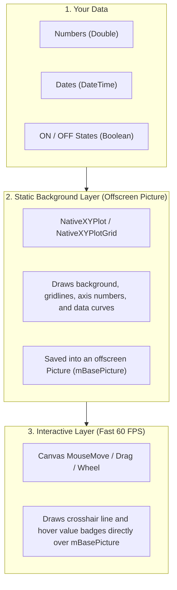

# NativeXYPlot & NativeXYPlotGrid Documentation

Welcome to **NativeXYPlot**! A fast, 100% pure native Xojo charting and multi-plot layout engine. It renders directly using native Xojo `Graphics`, `Picture`, and `PDFDocument` with zero dependencies.

---

## 1. How It Works (Architecture)

NativeXYPlot uses a simple, high-speed 2-layer design to give smooth 60 FPS drawing without flicker:



### Why this 2-layer design is fast:
1. **Background Picture (Layer 1)**: All the heavy math (thousands of data points, gridlines, text strings) is drawn once into an offscreen image (`Picture`).
2. **Foreground Canvas (Layer 2)**: When you move your mouse, Xojo simply draws the saved picture and paints a single vertical crosshair line with small number badges on top. This is fast and never lags.

---

## 2. `NativeXYPlot` API Reference

### Layout & Setup Methods

| Method | What It Does | Parameters & Simple Explanation |
| :--- | :--- | :--- |
| `Constructor(w, h)` | Creates a new plot object. | `w` (Width in pixels), `h` (Height in pixels). |
| `SetPlotArea(left, top, w, h, [bgCol], [gridCol])` | Sets the inner drawing box for curves. | `left`, `top`: Margins from canvas edge.<br>`w`, `h`: Width and height of inner box.<br>`bgCol`: Inside background color (default white).<br>`gridCol`: Grid line color (default light gray). |
| `AddTitle(titleText)` | Sets the main title on top. | `titleText`: Title string. Set to `""` to hide. |

### Scaling & Axes Methods

| Method | What It Does | Parameters & Simple Explanation |
| :--- | :--- | :--- |
| `SetXLinearScale(minVal, maxVal)` | Sets linear number scale for X axis. | `minVal`, `maxVal`: Lowest and highest X numbers. |
| `SetXDateScale(minSec, maxSec, [tickSec], [format])` | Sets time/date scale for X axis. | `minSec`, `maxSec`: Unix epoch seconds (`DateTime.SecondsFrom1970`).<br>`tickSec`: Step in seconds between gridlines (0 = auto).<br>`format`: Date format string (default auto). |
| `SetYLinearScale(minVal, maxVal, [unitStr])` | Sets linear number scale for Y axis. | `minVal`, `maxVal`: Lowest and highest Y numbers.<br>`unitStr`: Text added after numbers (e.g. `"°C"` or `" V"`). |
| `SetYDiscreteLabels(labels(), [minVal], [maxVal])` | Sets named text lanes on Y axis (for ON/OFF or states). | `labels`: Array of names like `Array("OFF", "ON")` or `Array("Valve", "Pump", "Relay")`.<br>`minVal`, `maxVal`: Numeric range for channel stacking. |
| `SetYTitle(titleText)` | Sets label above Y axis. | `titleText`: Axis title string (e.g. `"Voltage"`). |
| `AutoScale([marginPercent], [includeZero])` | Automatically fits both X and Y scales to data. | `marginPercent`: Percentage extra padding (default `0.05` = 5%).<br>`includeZero`: If `True`, keeps 0 visible on axis. |
| `AutoScaleX([marginPercent])` | Automatically fits only X axis to data. | `marginPercent`: Padding percentage. |
| `AutoScaleY([marginPercent], [includeZero])` | Automatically fits only Y axis to data. | `marginPercent`: Padding percentage.<br>`includeZero`: Keep 0 visible. |

### Data Series & Annotation Methods

| Method | What It Does | Parameters & Simple Explanation |
| :--- | :--- | :--- |
| `AddSeries(x(), y(), color, [name], [width], [showDots])` | Adds a continuous line curve. | `x()`, `y()`: Arrays of numbers.<br>`color`: Line color.<br>`name`: Legend label.<br>`width`: Line thickness in pixels.<br>`showDots`: Set `True` to draw circle dots on each data point. |
| `AddDateSeries(dates(), y(), color, [name], [width], [showDots])` | Adds a continuous line curve with dates. | `dates()`: Array of Xojo `DateTime` objects.<br>`y()`: Array of Y numbers. |
| `AddStepSeries(x(), y(), color, [name], [width], [showDots])` | Adds a square-wave / stair-step line. | Perfect for digital signals that jump instantly without sloped lines. |
| `AddDateStepSeries(dates(), y(), color, [name], [width], [showDots])` | Adds a square-wave step line with dates. | `dates()`: Array of `DateTime` objects. |
| `AddBooleanSeries(x(), states(), color, [name], [width], [highVal], [lowVal])` | Adds a True/False digital pulse line. | `states()`: Array of `Boolean` values (`True`/`False`).<br>`highVal`, `lowVal`: Top and bottom Y numbers for the pulse. |
| `AddDateBooleanSeries(dates(), states(), color, [name], [width], [highVal], [lowVal])` | Adds a True/False digital pulse line with dates. | `dates()`: Array of `DateTime` objects. |
| `AddThreshold(valA, valB, [zoneCol], [lineCol])` | Adds a shaded horizontal tolerance band. | Highlights a target range (like safe temperature between 20°C and 24°C). |
| `AddMarker(epochSec, label, [color])` | Adds a vertical event line with a text badge. | Marks important time events (like "Power Outage" or "Valve Opened"). |
| `ClearSeries()` | Removes all data series. | Useful for live streaming when refreshing buffers. |
| `ClearMarkers()` | Removes all vertical markers. | Clears event lines. |

### Drawing, Exporting & Coordinates Methods

| Method | What It Does | Parameters & Simple Explanation |
| :--- | :--- | :--- |
| `MakeChartPicture([w], [h]) As Picture` | Draws the chart into an offscreen bitmap image. | `w`, `h`: Optional custom image size in pixels. |
| `Render(g, [clearBackground])` | Draws the chart directly to a `Graphics` context. | `g`: Target graphics.<br>`clearBackground`: Set `False` when drawing multiple plots on one canvas. |
| `MakePDFDocument([fitPage], [landscape]) As PDFDocument` | Creates a crisp vector PDF document. | `fitPage`: Scales chart to fit PDF page.<br>`landscape`: Horizontal page orientation. |
| `ExportPDF(file, [fitPage], [landscape])` | Saves the vector PDF directly to disk. | `file`: Xojo `FolderItem` destination. |
| `DrawTrackingOverlay(g, mouseX, mouseY, [showValues], [showLegend])` | Draws hover crosshair and value badges. | `mouseX`, `mouseY`: Screen pixel position from `Canvas.MouseMove`. |
| `DrawTrackingOverlayByValue(g, targetDataX, [showValues], [showLegend])` | Draws crosshair snapped to a specific data value. | Used to synchronize hover crosshairs across multiple separate plots. |
| `ValueToScreenX(val) As Double` | Converts data X value to screen pixel X. | Useful for custom drawing on the plot. |
| `ValueToScreenY(val) As Double` | Converts data Y value to screen pixel Y. | Useful for custom drawing on the plot. |
| `ScreenToValueX(px) As Double` | Converts screen pixel X to data X value. | Converts mouse clicks back to data numbers. |
| `ScreenToValueY(px) As Double` | Converts screen pixel Y to data Y value. | Converts mouse clicks back to data numbers. |
| `GetNearestXValue(pixelX) As Double` | Finds the closest X data value near mouse. | Snaps hover lines to real data points. |

### `NativeXYPlot` Properties

| Property | Type | Default | What It Controls |
| :--- | :--- | :--- | :--- |
| `Width`, `Height` | `Integer` | `600`, `400` | Total canvas or export dimensions in pixels. |
| `PlotLeft`, `PlotTop` | `Integer` | `38`, `45` | Position of inner chart box inside canvas. |
| `PlotWidth`, `PlotHeight` | `Integer` | `524`, `320` | Width and height of inner chart box. |
| `PlotBgColor`, `GridColor` | `Color` | `&cFFFFFF`, `&cE0E0E0` | Background and gridline colors. |
| `Title`, `Y_Title`, `X_AxisTitle` | `String` | `""` | Top title and axis labels. |
| `DualYAxis` | `Boolean` | `True` | When `True`, draws symmetrical tick marks on both left and right edges. |
| `ShowLegend` | `Boolean` | `True` | When `True`, displays series legend. |
| `LegendPosition` | `Integer` | `1` | `0` = Top Left<br>`1` = Top Right (default inline)<br>`2` = Right Sidebar<br>`3` = Inside Card Box |
| `ShowSymbols` | `Boolean` | `True` | When `True`, draws data point circle dots. When `False`, renders clean lines only. |
| `AllowZoom` | `Boolean` | `True` | When `True`, enables mouse wheel zooming on this individual graph. |
| `AllowPan` | `Boolean` | `True` | When `True`, enables click-and-drag panning on this individual graph. |
| `Visible` | `Boolean` | `True` | Controls whether this plot draws and responds to mouse clicks. |
| `ShowThreshold` | `Boolean` | `False` | Shows or hides horizontal tolerance band. |
| `Threshold_A`, `Threshold_B` | `Double` | `0.0`, `0.0` | Upper and lower values for tolerance band. |
| `ThresholdZoneColor`, `ThresholdColor` | `Color` | `&cC0C0C0`, `&c707070` | Colors for tolerance fill and boundary lines. |
| `X_Min`, `X_Max`, `Y_Min`, `Y_Max` | `Double` | `0.0`, `100.0` | Outer limits of X and Y axes. |
| `Y_Unit` | `String` | `""` | Text added to Y axis numbers (e.g. `" psi"` or `"°C"`). |
| `Y_TickDensity` | `Integer` | `30` | Controls spacing between horizontal grid lines. |
| `IsDateAxis` | `Boolean` | `False` | When `True`, X axis formats numbers as date/time strings. |
| `ShowXAxisLabels` | `Boolean` | `True` | When `False`, hides bottom X axis numbers (great for stacked plots). |
| `SeriesCount` | `Integer` | `0` | Total number of active data series. |

---

## 3. `NativeXYPlotGrid` API Reference (Multi-Plot Matrix)

`NativeXYPlotGrid` organizes multiple plots into rows and columns on a single canvas.

```
+---------------------------------------------------+
|  NativeXYPlotGrid (e.g. 2 Rows x 2 Columns)       |
|                                                   |
|  [ Cell (0, 0): Plot A ]   [ Cell (0, 1): Plot B ]|
|  (Live Stream Sensor)      (Harmonic Waveform)    |
|                                                   |
|  [ Cell (1, 0): Plot C ]   [ Cell (1, 1): Plot D ]|
|  (IoT Climate 7-Days)      (Digital I/O Tracks)   |
+---------------------------------------------------+
```

### Setup & Layout Methods

| Method | What It Does | Parameters & Simple Explanation |
| :--- | :--- | :--- |
| `Constructor(w, h, [rows=2], [cols=2])` | Creates a new multi-plot grid. | `w`, `h`: Total canvas dimensions in pixels.<br>`rows`, `cols`: Number of cell rows and columns (e.g. `2, 2` for 2x2 grid). |
| `Plot(row, col) As NativeXYPlot` | Gets or auto-creates the plot at cell `(row, col)`. | `row`: 0-indexed row number.<br>`col`: 0-indexed column number. |
| `SetPlot(row, col, plot)` | Places your own `NativeXYPlot` instance into cell `(row, col)`. | Lets you insert a custom pre-configured plot into the grid. |
| `HasPlot(row, col) As Boolean` | Checks if a cell has an active plot object. | Returns `True` if a plot exists at `(row, col)`. |
| `ClearPlots()` | Clears all plot instances from the grid. | Resets the grid. |
| `SetGrid(rows, cols)` | Changes number of rows and columns. | Resizes the grid matrix dynamically. |
| `SetDimensions(w, h)` | Changes canvas width and height. | Automatically recalculates all subplot positions. |
| `SetSpacing(hGap, vGap, [mLeft=38], [mRight=38], [mTop=35], [mBottom=35])` | Sets gaps between plots and outer margins. | `hGap`, `vGap`: Space in pixels between adjacent subplots.<br>`mLeft`, `mRight`, `mTop`, `mBottom`: Outer border padding. |
| `RecalculateLayout()` | Recomputes pixel positions for all cells. | Adjusts coordinates whenever dimensions or spacing change. |

### Hit-Testing & Interactive Mouse Dispatch Methods

| Method | What It Does | Parameters & Simple Explanation |
| :--- | :--- | :--- |
| `GetPlotAt(screenX, screenY) As NativeXYPlot` | Finds which plot is under mouse coordinates. | Returns the `NativeXYPlot` under the cursor, or `Nil`. |
| `GetPlotAt(screenX, screenY, ByRef row, ByRef col) As NativeXYPlot` | Finds plot under mouse and returns its row/col. | Outputs `row` and `col` integers via `ByRef`. |
| `HandleMouseWheel(x, y, deltaX, deltaY, [zoomFactor=1.2]) As Boolean` | Zooms into the specific subplot under cursor. | Automatically zooms only the clicked cell (or all linked plots if linked). |
| `HandleMouseDrag(deltaX, deltaY, hitPlot) As Boolean` | Pans the specific subplot under cursor. | Automatically scrolls the active plot during mouse dragging. |
| `AutoScaleAll([marginPercent=0.05], [includeZero=False])` | Fits axes on all subplots in the grid. | Runs `AutoScale()` across all cells. |
| `AutoScaleRow(row, [marginPercent=0.05], [includeZero=False])` | Fits axes on all plots in a specific row. | Scales cells in row `row`. |
| `AutoScaleColumn(col, [marginPercent=0.05], [includeZero=False])` | Fits axes on all plots in a specific column. | Scales cells in column `col`. |

### Rendering & Vector Export Methods

| Method | What It Does | Parameters & Simple Explanation |
| :--- | :--- | :--- |
| `Render(g, [clearBackground=True])` | Draws entire multi-plot grid to target `Graphics` context. | `g`: Target graphics.<br>`clearBackground`: Clears outer canvas with white background. |
| `MakeChartPicture([w], [h]) As Picture` | Draws entire grid into an offscreen bitmap `Picture`. | `w`, `h`: Optional custom image size. |
| `MakePDFDocument([fitPage=True], [landscape=True]) As PDFDocument` | Creates a crisp vector PDF document of entire grid. | Infinitely sharp scalable vector paths and fonts. |
| `ExportPDF(file, [fitPage=True], [landscape=True])` | Saves the vector PDF directly to a file on disk. | `file`: Destination `FolderItem`. |
| `DrawTrackingOverlay(g, mouseX, mouseY, [showValues=True], [showLegend=False])` | Draws hover crosshair and value badges. | Snaps to data points in active cell or broadcasts across linked cells. |
| `DrawTrackingOverlayByValue(g, targetDataX, [showValues=True], [showLegend=False])` | Draws crosshair snapped to a specific X value across all cells. | Used for synchronizing multiple stacked timeline plots. |

### `NativeXYPlotGrid` Properties

| Property | Type | Default | What It Controls |
| :--- | :--- | :--- | :--- |
| `Width`, `Height` | `Integer` | `800`, `600` | Overall grid canvas dimensions in pixels. |
| `Rows`, `Columns` | `Integer` | `2`, `2` | Number of cell rows and columns. |
| `MarginLeft`, `MarginRight` | `Integer` | `38`, `38` | Outer left and right margins in pixels. |
| `MarginTop`, `MarginBottom` | `Integer` | `35`, `35` | Outer top and bottom margins in pixels. |
| `GapX`, `GapY` | `Integer` | `45`, `35` | Gap in pixels between neighboring subplot cells. |
| `LinkAllX` | `Boolean` | `False` | When `True`, zooming or panning any plot scrolls all plots together. |
| `LinkColumnX` | `Boolean` | `False` | When `True`, links plots vertically in same column and auto-hides upper X labels. |
| `SyncCrosshair` | `Boolean` | `True` | When `True`, hover crosshairs are broadcast across all subplots. |
| `ShowSymbols` | `Boolean` | `True` | Global toggle for data point dots on subplots. |

---

## 4. Practical Recipes

### Recipe 1: 2x2 Multi-Plot Matrix (Heterogeneous Chart Types)
```vb
// 1. Create a 2x2 grid container
Var grid As New NativeXYPlotGrid(Canvas1.Width, Canvas1.Height, 2, 2)
grid.SetSpacing(45, 30, 38, 38, 25, 30)

// 2. Cell (0, 0): Live Pressure Sensor
Var p00 As NativeXYPlot = grid.Plot(0, 0)
p00.SetXLinearScale(0, 60)
p00.SetYLinearScale(0, 100, " psi")
p00.SetYTitle("Pressure")
p00.AddSeries(xVals, yPress, &c0077B6, "Feed A", 2)

// 3. Cell (0, 1): Voltage Math Waveforms
Var p01 As NativeXYPlot = grid.Plot(0, 1)
p01.SetXLinearScale(0, 100)
p01.SetYLinearScale(-10, 10, " V")
p01.SetYTitle("Voltage")
p01.AddSeries(xVals, yVolt, &c3185FC, "Sine", 2)

// 4. Cell (1, 0): Temperature Telemetry (7-Days)
Var p10 As NativeXYPlot = grid.Plot(1, 0)
p10.SetXDateScale(dStart.SecondsFrom1970, dEnd.SecondsFrom1970)
p10.SetYLinearScale(16.0, 28.0, "°C")
p10.SetYTitle("Temperature")
p10.AddDateSeries(dateArray, tempArray, &cFA9B70, "Living Room", 2)

// 5. Cell (1, 1): Digital Actuator States (Discrete Channels)
Var p11 As NativeXYPlot = grid.Plot(1, 1)
p11.SetXDateScale(dStart.SecondsFrom1970, dEnd.SecondsFrom1970)
p11.SetYDiscreteLabels(Array("Valve", "Pump", "Relay"), -0.2, 3.1)
p11.SetYTitle("Channels")
p11.AddDateBooleanSeries(dateArray, relayArray, &c3185FC, "Relay", 2, 2.8, 2.1)

// 6. Draw to Canvas Backdrop
Canvas1.Backdrop = grid.MakeChartPicture()
```

---

### Recipe 2: Independent Zoom & Pan per Subplot
In your `Canvas` event handlers:

```vb
// In Canvas.MouseDown:
Function MouseDown(x As Integer, y As Integer) As Boolean
  mStartX = x
  mStartY = y
  mIsDragging = True
  mActiveHitPlot = mGrid.GetPlotAt(x, y) // Finds clicked plot
  Return True
End Function

// In Canvas.MouseDrag:
Sub MouseDrag(x As Integer, y As Integer)
  If mIsDragging And mActiveHitPlot <> Nil Then
    Var deltaX As Integer = mStartX - x
    Call mGrid.HandleMouseDrag(deltaX, 0, mActiveHitPlot)
    mStartX = x
    mStartY = y
    RedrawCanvas()
  End If
End Sub

// In Canvas.MouseWheel:
Function MouseWheel(x As Integer, y As Integer, deltaX As Integer, deltaY As Integer) As Boolean
  // Zooms only the subplot under cursor:
  If mGrid.HandleMouseWheel(x, y, deltaX, deltaY, 1.2) Then
    RedrawCanvas()
    Return True
  End If
  Return False
End Function
```

---

### Recipe 3: Real-Time Streaming Ring Buffer (250ms Timer)
```vb
Sub SimTimer_Action()
  mStep = mStep + 1
  Var nowSec As Double = DateTime.Now.SecondsFrom1970
  
  // 1. Append new reading to ring buffer
  mBufTime.Add(nowSec)
  mBufPsi.Add(50.0 + Sin(mStep * 0.2) * 15.0 + Rnd * 4.0)
  mBufFlow.Add(120.0 + Cos(mStep * 0.15) * 20.0)
  
  // 2. Keep last 60 points
  If mBufTime.Count > 60 Then
    mBufTime.RemoveAt(0)
    mBufPsi.RemoveAt(0)
    mBufFlow.RemoveAt(0)
  End If
  
  // 3. Update plot
  Var pLive As NativeXYPlot = mGrid.Plot(0, 0)
  pLive.ClearSeries()
  pLive.AddDateSeries(mBufTime, mBufPsi, &c0077B6, "Pressure", 2)
  pLive.AddDateSeries(mBufTime, mBufFlow, &cF77F00, "Flow", 2)
  pLive.SetXDateScale(mBufTime(0), mBufTime(mBufTime.LastIndex))
  
  // 4. Redraw
  mBasePic = mGrid.MakeChartPicture(Canvas1.Width, Canvas1.Height)
  Canvas1.Refresh
End Sub
```

---

### Recipe 4: Synchronized 3-Plot Scrubbing
```vb
Var grid As New NativeXYPlotGrid(Canvas1.Width, Canvas1.Height, 3, 1)
grid.LinkColumnX = True    // Links all 3 rows along same time axis
grid.SyncCrosshair = True  // Moving mouse on one plot moves crosshair on all 3

// Canvas.Paint:
Sub Paint(g As Graphics, areas() As Rect)
  g.DrawPicture(mBasePicture, 0, 0)
  If mMouseX >= 0 Then
    grid.DrawTrackingOverlay(g, mMouseX, mMouseY, True)
  End If
End Sub
```

---

## 5. Keyboard Shortcuts & Interactivity Guide

The demo window includes fast interactive keyboard toggles:

| Key / Input | Action | Description |
| :---: | :--- | :--- |
| **`P`** | **Toggle Data Point Dots** | Toggles point dots on/off. When OFF, shows clean continuous lines only. When ON, shows lines + circle dots at each data point. |
| **`L`** | **Toggle Tracking Legend Badge** | Shows/hides the dark legend summary card inside the hover crosshair overlay. |
| **Mouse Drag** | **Pan Viewport** | Click and drag horizontally to scroll through time or numeric data. |
| **Mouse Wheel** | **Zoom In / Out** | Scroll mouse wheel to zoom into data centered at cursor position. |

---

## 6. Vector PDF & Image Exporting

### Export High-Resolution PNG
```vb
Var pic As Picture = plot.MakeChartPicture(1920, 1080)
Var f As FolderItem = FolderItem.ShowSaveFileDialog(".png", "Chart.png")
If f <> Nil Then
  pic.Save(f, Picture.Formats.PNG)
End If
```

### Export Vector PDF (Infinitely Sharp)
```vb
Var f As FolderItem = FolderItem.ShowSaveFileDialog(".pdf", "Chart.pdf")
If f <> Nil Then
  plot.ExportPDF(f, fitPage = True, landscape = True)
End If
```
For grids, use `grid.ExportPDF(f, fitPage = True, landscape = True)`.

---

## 7. Contributing & Feedback

Contributions, bug reports, pull requests, and feature requests are warmly welcomed and appreciated!
- **GitHub Issues**: Report bugs or request new features at [Issues](https://github.com/0xb01/NativeXYPlot/issues).
- **Pull Requests**: Submit improvements, tests, or documentation fixes at [Pull Requests](https://github.com/0xb01/NativeXYPlot/pulls).

---

## 8. License

NativeXYPlot is open-source software licensed under the **MIT License**. Free for personal, commercial, and enterprise applications.

