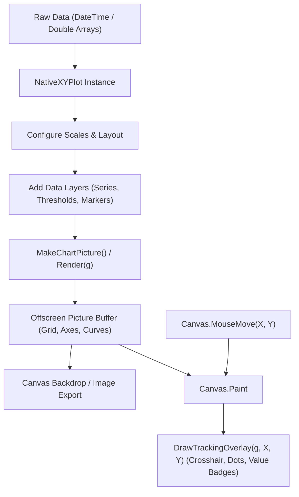

# NativeXYPlot Documentation

Zero-dependency 2D plotting engine for Xojo Desktop and Web. Pure native Xojo code using `Graphics` and `Picture`.

---

## 1. Architecture



- **Static Layer**: Render axes, grid, and curves once into `Picture` via `MakeChartPicture()`.
- **Interactive Layer**: Fast 60 FPS overlay drawing in `Canvas.Paint` via `DrawTrackingOverlay(g, X, Y)`.

---

## 2. API Reference

### Layout & Setup
| Method | Description |
| :--- | :--- |
| `Constructor(w As Integer = 600, h As Integer = 400)` | Initialize plot with canvas/export dimensions. |
| `SetPlotArea(left, top, w, h, [bgColor], [gridCol])` | Set interior plot box coordinates and colors. |
| `AddTitle(titleText)` | Set top header label. |

### Scaling & Axes
| Method | Description |
| :--- | :--- |
| `SetXLinearScale(minVal, maxVal)` | Configure linear numeric X-axis. |
| `SetXDateScale(minSec, maxSec, [majorTickSec], [formatStr])` | Configure time-series X-axis using Unix epoch seconds (`DateTime.SecondsFrom1970`). |
| `SetYLinearScale(minVal, maxVal, [unitStr])` | Configure linear numeric Y-axis with unit suffix (e.g. `"°C"`). |
| `SetYDiscreteLabels(labels(), [minVal], [maxVal])` | Configure discrete categorical Y-axis (e.g. `Array("OFF", "ON")`). |
| `SetYTitle(titleText)` | Set label above Y-axis. |

### Data Series & Annotations
| Method | Description |
| :--- | :--- |
| `AddSeries(x(), y(), color, [name], [width], [showDots])` | Numeric continuous curve. |
| `AddDateSeries(dates(), y(), color, [name], [width], [showDots])` | `DateTime` continuous curve. |
| `AddStepSeries(x(), y(), color, [name], [width], [showDots])` | Numeric square-wave step curve. |
| `AddDateStepSeries(dates(), y(), color, [name], [width], [showDots])` | `DateTime` square-wave step curve. |
| `AddBooleanSeries(x(), states(), color, [name], [width], [highVal], [lowVal])` | Boolean pulse series (`True` -> `highVal`, `False` -> `lowVal`). |
| `AddDateBooleanSeries(dates(), states(), color, [name], [width], [highVal], [lowVal])` | `DateTime` boolean pulse series. |
| `AddThreshold(lower, upper, [zoneCol], [lineCol])` | Shaded horizontal tolerance band. |
| `AddMarker(epochSec, label, [color])` | Vertical event line marker with label badge. |
| `ClearSeries()` / `ClearMarkers()` | Reset data series or markers. |

### Rendering & Coordinates
| Method | Description |
| :--- | :--- |
| `MakeChartPicture([w], [h]) As Picture` | Render static bitmap image. |
| `Render(g As Graphics)` | Draw complete chart directly to target graphics context. |
| `DrawTrackingOverlay(g, mouseX, mouseY, [showValues])` | Draw interactive crosshair and snapped value badges. |
| `ValueToScreenX(val)` / `ValueToScreenY(val)` | Convert data value to screen pixel coordinate. |
| `ScreenToValueX(px)` / `ScreenToValueY(px)` | Convert screen pixel coordinate to data value. |
| `GetNearestXValue(pixelX) As Double` | Find closest X data value to cursor. |

---

## 3. Public Properties

| Property | Type | Default | Description |
| :--- | :--- | :--- | :--- |
| `Width`, `Height` | `Integer` | `600`, `400` | Overall canvas / export dimensions in pixels. |
| `PlotLeft`, `PlotTop` | `Integer` | `50`, `45` | Interior plot margins in pixels. |
| `PlotWidth`, `PlotHeight` | `Integer` | `500`, `325` | Interior plot dimensions in pixels. |
| `PlotBgColor`, `GridColor` | `Color` | `&cFFFFFF`, `&cE0E0E0` | Plot background and gridline colors. |
| `Title`, `Y_Title`, `X_AxisTitle` | `String` | `""` | Chart and axis titles. |
| `DualYAxis` | `Boolean` | `True` | Draw symmetrical right-side Y ticks/labels. |
| `ShowLegend` | `Boolean` | `True` | Toggle legend display. |
| `LegendPosition` | `Integer` | `1` | `0` (Top Left), `1` (Top Right, default), `2` (Right Sidebar), `3` (Inside Box). |
| `ShowThreshold` | `Boolean` | `False` | Toggle threshold band display. |
| `Threshold_A`, `Threshold_B` | `Double` | `0.0`, `0.0` | Threshold band boundaries. |
| `ThresholdZoneColor`, `ThresholdColor` | `Color` | `&cC0C0C0`, `&c707070` | Threshold band fill and border colors. |
| `X_Min`, `X_Max`, `Y_Min`, `Y_Max` | `Double` | `0.0`, `100.0` | Axis boundary limits. |
| `Y_Unit` | `String` | `""` | Unit suffix for Y values (e.g. `"°C"`). |
| `Y_TickDensity` | `Integer` | `30` | Pixel density controlling Y tick frequency. |
| `IsDateAxis` | `Boolean` | `False` | Time-series epoch date mode toggle. |
| `SeriesCount` | `Integer` | `0` | Number of active series. |

---

## 4. Usage Recipes

### Numeric Line Chart
```vb
Var plot As New NativeXYPlot(Canvas1.Width, Canvas1.Height)
plot.SetPlotArea(50, 20, Canvas1.Width - 80, Canvas1.Height - 50)
plot.SetXLinearScale(0, 100)
plot.SetYLinearScale(0, 50, " %")
plot.AddSeries(xVals, yVals, Color.Blue, "Signal", 2, True)

Canvas1.Backdrop = plot.MakeChartPicture()
```

### Time-Series IoT Chart with Threshold
```vb
Var plot As New NativeXYPlot(Canvas1.Width, Canvas1.Height)
plot.AddTitle("Temperature Log")
plot.SetPlotArea(60, 45, Canvas1.Width - 120, Canvas1.Height - 80)
plot.SetXDateScale(dStart.SecondsFrom1970, dEnd.SecondsFrom1970)
plot.SetYLinearScale(15.0, 30.0, "°C")

plot.AddThreshold(20.0, 24.0, &cE8F5E9, &c81C784)
plot.AddDateSeries(dateArray, tempArray, &c3185FC, "Room 1", 2)
plot.AddMarker(eventDate.SecondsFrom1970, "Event", &cE63946)

Canvas1.Backdrop = plot.MakeChartPicture()
```

### Digital State / Relay Timing
```vb
Var plot As New NativeXYPlot(Canvas1.Width, Canvas1.Height)
plot.SetPlotArea(60, 45, Canvas1.Width - 120, Canvas1.Height - 80)
plot.SetXDateScale(dStart.SecondsFrom1970, dEnd.SecondsFrom1970)
plot.SetYDiscreteLabels(Array("OFF", "ON"), -0.2, 1.2)
plot.AddDateBooleanSeries(dateArray, pumpStates, &cE63946, "Pump", 2)

Canvas1.Backdrop = plot.MakeChartPicture()
```
